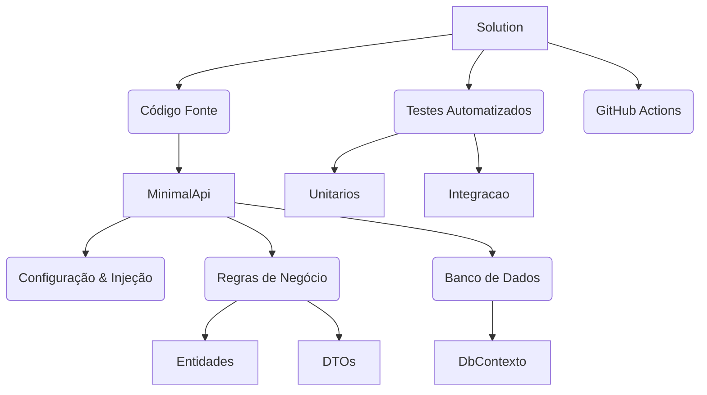

# 🚗 API de Gestão de Veículos (Minimal API .NET 9)


[](https://github.com/cleofasjunior/minimal-api/actions/workflows/dotnet.yml)


## 📖 Sobre o Projeto

Este projeto é uma Minimal API robusta desenvolvida para resolver o problema de **Gestão de Frotas e Controle de Acesso**. O objetivo foi ir além do básico, criando uma solução segura, escalável e testável, utilizando as tecnologias mais modernas do ecossistema .NET.

A aplicação implementa um sistema completo de **Controle de Acesso Baseado em Funções (RBAC)** e conta com uma esteira de **CI (Integração Contínua)** automatizada.

---

## 🏗️ Arquitetura e Organização

O projeto segue os princípios de **Clean Code**, **Separação de Responsabilidades** e **S.O.L.I.D**.



### 📂 Estrutura de Pastas (Refatorada)

A organização reflete uma arquitetura profissional, separando configurações de infraestrutura da lógica de negócios:

```plaintext
📦 MinimalApi.sln
 ┣ 📂 .github
 ┃ ┗ 📂 workflows
 ┃   ┗ 📜 dotnet.yml       # Pipeline de CI/CD (Build & Test Automático)
 ┣ 📂 src
 ┃ ┗ 📂 MinimalApi
 ┃   ┣ 📂 Dominio
 ┃   ┃ ┣ 📂 DTOs           # Objetos de Transferência (Dados de Entrada/Saída)
 ┃   ┃ ┣ 📂 Entidades      # Classes Principais (Veículo, Administrador)
 ┃   ┃ ┗ 📂 Enums          # Regras Fortes (Perfil Adm/Editor)
 ┃   ┣ 📂 Extensoes        # Configurações Isoladas (Clean Program.cs)
 ┃   ┃ ┣ 📜 AppExtensao.cs
 ┃   ┃ ┣ 📜 BuilderExtensao.cs
 ┃   ┃ ┗ 📜 EndpointExtensao.cs
 ┃   ┣ 📂 Infraestrutura
 ┃   ┃ ┗ 📂 Db             # Contexto do Entity Framework
 ┃   ┣ 📂 Services         # Regras de Aplicação (Token JWT)
 ┃   ┗ 📜 Program.cs       # Ponto de Entrada Minimalista
 ┗ 📂 tests
   ┗ 📂 MinimalApi.Tests
     ┣ 📂 Dominio          # Testes de Unidade
     ┗ 📂 Integration      # Testes de Integração (WebApplicationFactory)

```

## 🚀 Tecnologias e Decisões Técnicas

| Tecnologia | Função no Projeto | Motivo da Escolha |
| --- | --- | --- |
| **.NET 9** | Core Framework | Performance superior e uso nativo de Minimal APIs. |
| **GitHub Actions** | DevOps (CI) | Automação de Build e Testes a cada commit na branch main. |
| **EF Core** | ORM | Abstração do banco de dados (suporte a SQL Server e InMemory). |
| **JWT Bearer** | Segurança | Padrão de mercado para APIs Stateless e seguras. |
| **User Secrets** | Segurança Local | Proteção de credenciais sensíveis em ambiente de desenvolvimento. |
| **MSTest + Mvc.Testing** | QA | Testes de integração que sobem a API em memória para simulação real. |

## 🔒 Segurança e Controle de Acesso

O projeto implementa camadas rigorosas de segurança:

1. **Autenticação JWT:** Acesso restrito via Token Bearer.
2. **RBAC (Role-Based Access Control):**
* *Adm:* Acesso total (CRUD Veículos + Gestão de Admins).
* *Editor:* Acesso operacional (Apenas Veículos, sem deletar).


3. **Segurança de Credenciais:** Nenhuma senha é hardcoded no código fonte. O projeto utiliza `User Secrets` localmente e Variáveis de Ambiente no CI.

## 🧪 Testes e Qualidade

A aplicação possui cobertura de testes garantida via Pipeline de CI:

* [x] **Testes de Unidade:** Validam regras de negócio isoladas.
* [x] **Testes de Integração:** Simulam o servidor real (`WebApplicationFactory`).
* Verifica fluxo de Login e Geração de Token.
* Verifica Autorização (Acesso negado sem token).
* Verifica Persistência no Banco em Memória.


Para rodar os testes localmente:

```bash
dotnet test

```

## 🛠️ Como Executar o Projeto

### Pré-requisitos

* .NET SDK 9.0 instalado.

### Passo a Passo

1. **Clone o repositório:**
```bash
git clone [https://github.com/cleofasjunior/minimal-api.git](https://github.com/cleofasjunior/minimal-api.git)

```


2. **Entre na pasta:**
```bash
cd minimal-api

```


3. **Configure os Segredos (Opcional para Rodar, Obrigatório para Segurança):**
```bash
cd src/MinimalApi
dotnet user-secrets init
dotnet user-secrets set "Jwt:Key" "SuaSenhaSuperSecretaLocalAqui"

```


4. **Execute a API:**
```bash
dotnet run

```


5. **Acesse a Documentação:**
Abra `http://localhost:5xxx/swagger` no navegador.

### Usuário Padrão (Seed)

* **Email:** `adm@teste.com`
* **Senha:** `123456`

---

## 📝 Aprendizados e Evolução

O desenvolvimento deste projeto foi uma jornada de aprofundamento em Engenharia de Software com .NET 9. O que começou como uma API simples evoluiu para uma solução profissional. Principais competências adquiridas:

* **Arquitetura Limpa em Minimal APIs:** Aprendi a evitar o "God Class" no `Program.cs` utilizando **Extension Methods**. Isso permitiu organizar a injeção de dependências e rotas em arquivos separados (`Extensoes`), mantendo o código legível e escalável.
* **Segurança Além do Código:** Compreendi a importância de não versionar segredos. A migração de chaves hardcoded para **User Secrets** (em Dev) e **Environment Variables** (em CI) foi um passo crucial para a segurança do projeto.
* **Testes de Verdade:** Fui além dos testes unitários simples. A implementação de **Testes de Integração** com `WebApplicationFactory` me permitiu validar o fluxo completo (HTTP -> Controller -> Banco em Memória) garantindo que a segurança e as rotas funcionem de ponta a ponta.
* **Cultura DevOps:** A configuração do **GitHub Actions** transformou o repositório. Agora, a cada push, o código é compilado e testado automaticamente, impedindo que regressões cheguem à branch principal.

---

<div align="center">
<b>Desenvolvido por Cleofas Junior</b>


Foco em desenvolvimento .NET robusto, Arquitetura de Software e DevOps.


<a href="https://github.com/cleofasjunior">Portfólio GitHub</a>
</div>
